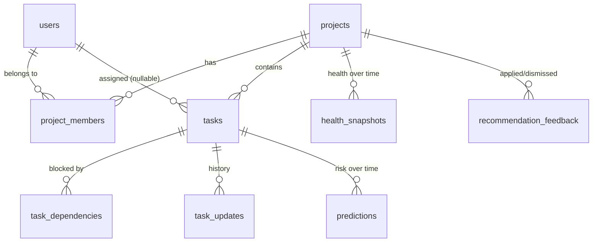

# Database design

PostgreSQL in production (`DATABASE_URL=postgresql+psycopg://…`), SQLite for zero-setup local runs. All timestamps are
stored in UTC (incoming datetimes are normalised in `schemas.py`).

| Table | Key columns | Constraints & indexes | Why it exists |
|---|---|---|---|
| users | id PK, email UNIQUE | index on email | accounts; bcrypt hash only |
| projects | id PK, created_by FK→users | CHECK end_date > start_date | planned timeline for schedule-lag signal |
| project_members | id PK, (project_id, user_id) UNIQUE | CHECK role ∈ {manager, member}, capacity > 0; index user_id | the team, RBAC role and capacity (a separate `teams` table would duplicate this) |
| tasks | id PK, project_id FK (CASCADE), assignee_id FK (SET NULL) | CHECK status/priority/type enums, points ≥ 0; indexes (project_id, status), assignee_id, deadline | Kanban cards |
| task_dependencies | (task_id, depends_on_id) composite PK | CHECK task_id ≠ depends_on_id; index depends_on_id; cycle check in API | "cannot finish before" |
| task_updates | id PK, task_id FK | index (task_id, created_at) | append-only audit log; gives cycle time and reassignment counts |
| predictions | id PK, task_id FK | CHECK 0 ≤ p ≤ 1; index (task_id, created_at) | stored only when p changes ≥ 2 points or the model version changes |
| health_snapshots | id PK, project_id FK | index (project_id, created_at) | explains health trend |
| recommendation_feedback | id PK, project_id FK | CHECK action ∈ {applied, dismissed} | measures recommendation usefulness (acceptance rate) |

`productivity_metrics` and `recommendations` tables from the original list were intentionally **not** created:
both are derived on demand from the tables above (storing them would duplicate data that can go stale).
For schema changes beyond the prototype, add Alembic migrations instead of `create_all`.
